this project is based on [furrysalamander/rubedo](https://github.com/furrysalamander/rubedo) but uses a CNN instead of variance for calculating scores

# Introduction

this tool automatically calibrates pressure advance for FDM 3d printers using laser triangulation and a CNN model

## Problem Statement

In a 3d printer, the filament comes out based on the **pressure** in the nozzle.  When the printer speeds up or slows down, like when going around corners, it takes a bit for the nozzle pressure to catch up. If the printer moves too fast too soon, not enough filament comes out. And if it slows down too quickly, too much filament comes out. This can cause **over-extrusion** at deceleration and **under extrusion** at acceleration which affects **print-quality**, **accuracy** and possibly **print speeds**.

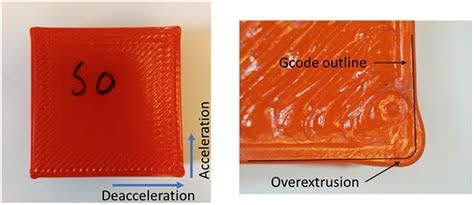

## Pressure Advance

**Pressure Advance** *(PA)* is a feature in 3d printer firmware that compensates for the lag between the extruder motor movement and the actual extrusion of filament, ensuring the right amount of filament is extruded as the printer speeds up or slows down. The issue is that the actual amount of compensation can vary due to many factors such as **filament** **type**, **temperature**  or  **filament color**

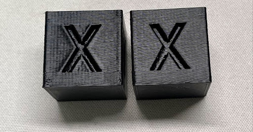

## PA Calibration

the way this value is commonly calibrated is by printing multiple lines at varying accelerations and PA values and picking the line that looks the best, IE: the line with the least over or under extrusion

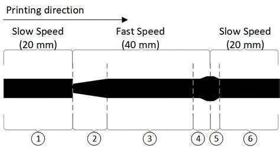 

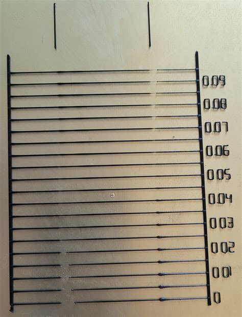

## Our Solution

Our solution is to mount a small camera and a line laser on the 3d printer extruder. to record a video of the calibration lines and then convert it to a heightmap. We will then input the heightmap into a CNN model that predicts the ideal PA value

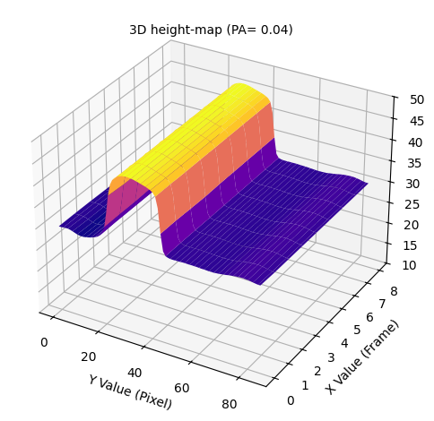

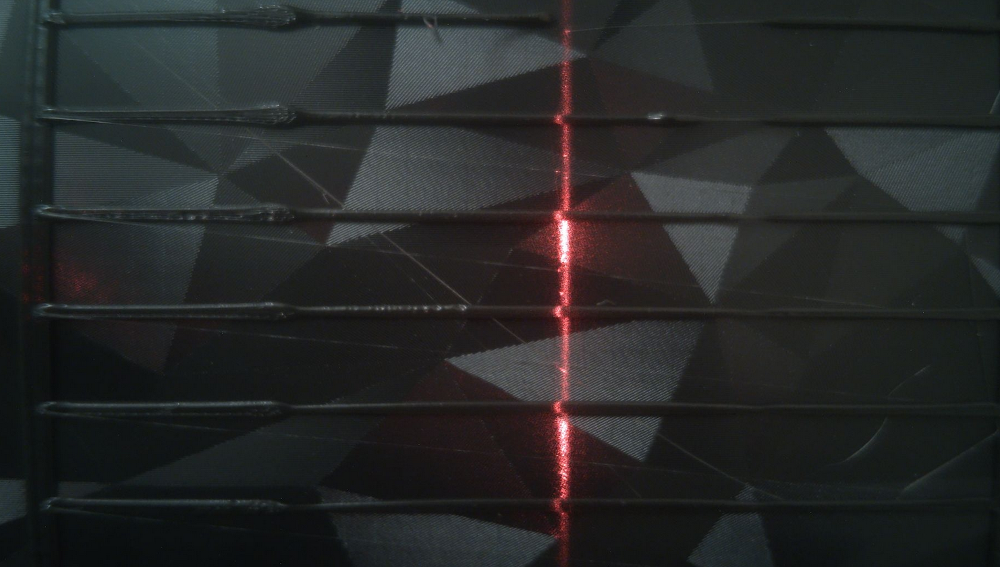

## 3D-printer Setup

Our 3D-printer has klipper firmware installed which allows for communication between the printers main-board and a raspberry pi. We can send g-code to the raspberry pi from any device via the web in order to control the printer. 

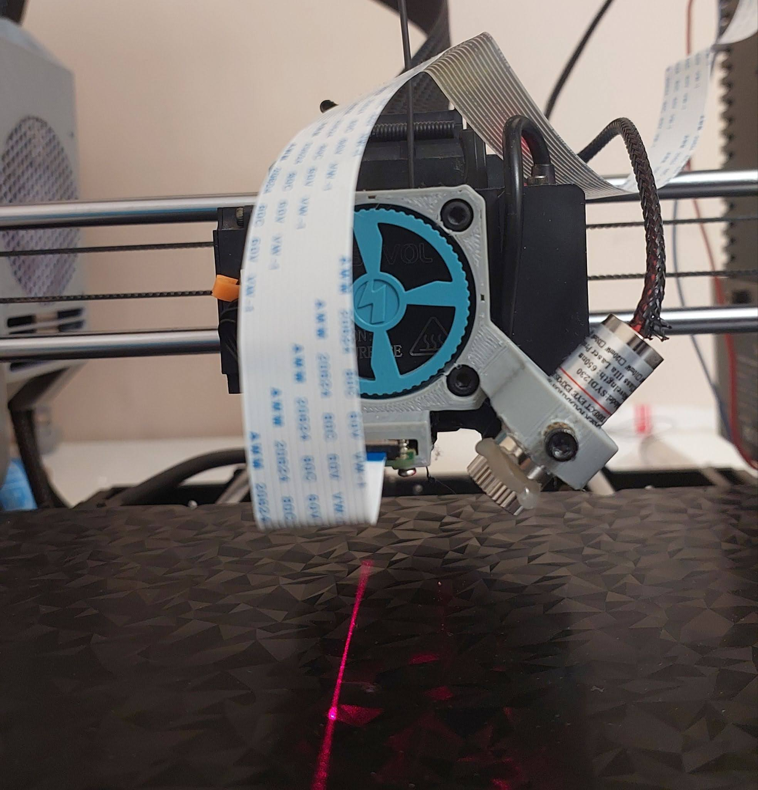

## How did we get the height maps?

We were able to calculate a heightmap for each line via a method called laser triangulation Here’s how it works:

- A laser projects a thin beam or line onto a surface at a known angle (in our case 45 degrees).
    
- A camera or sensor is placed directly above the lines.
    
- The laser spot’s position appears shifted in the camera’s field of view depending on the distance to the object.
    
- By analyzing this shift (using simple trigonometry/triangulation), the exact distance from the sensor to the surface at each point is calculated.

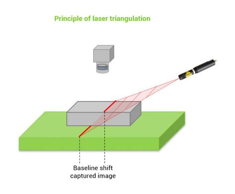

## data gathering

We recorded a total of 80 height maps in batches of ten, each height map was then given a score (Label) between 0 and 1 (the most consistent line got a score of 1 while the least consistent got a score of 0.1)

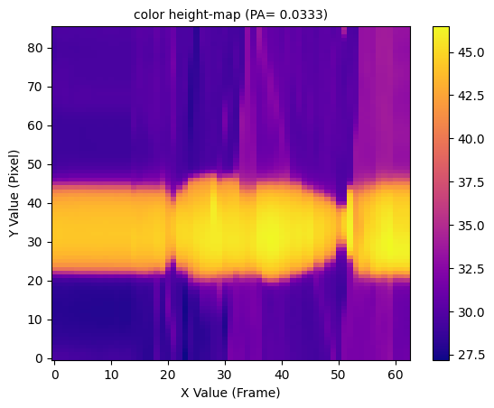

## CNN

The heightmaps were then used to train a regression CNN with the scores used as labels. We were able to achieve a R2 score of 0.8, validation loss of 0.0130, RMSE of 0.1140

For the final prediction we input 10 height maps, predict the score of each one and pick the line with the highest score.

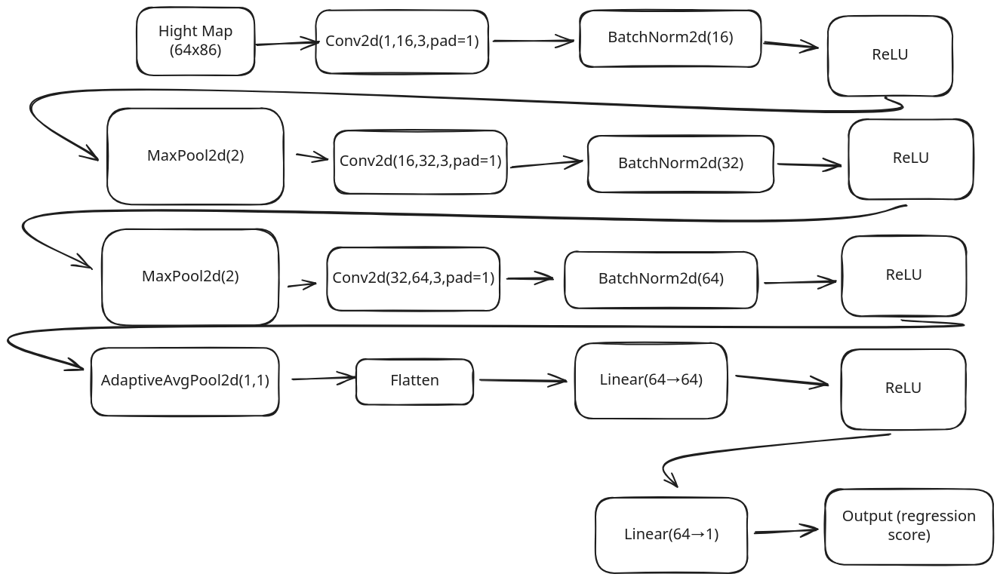

## Results

Our model picked the best option about 50% of the time and picked the second best about 50% of the time. Which is more than good enough as the difference between the best two lines is small and negligible.

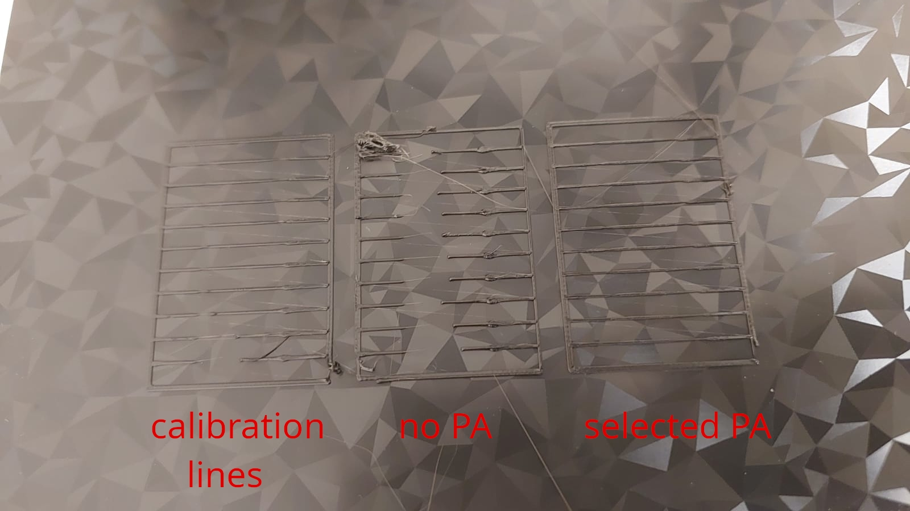